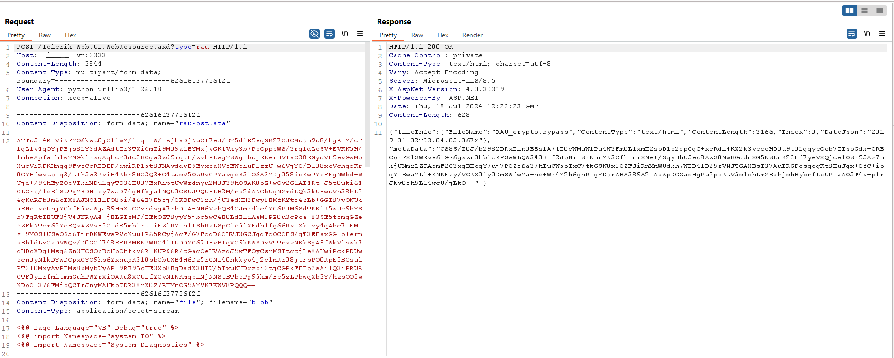
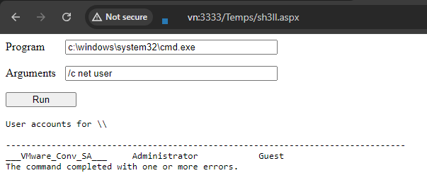

# CVE-2017-11317-and-CVE-2017-11357-in-Telerik

# Description

This couple of CVEs is from the module Upload file.

The version of Telerik UI for ASP.NET AJAX from R1 2017 to R2 2017 SP2 has a couple of encryption Key which were hardcoded:


If developers do not use a custom ones, this default key always be used to encrypt and decrypt the user input

The default encryption key open the way to 02 attack surface of the module:
    
+ ``CVE-2017-11317``: Allow attackers choose the dest folder of the uploaded file
+ ``CVE-2017-11357``: Allow attackers upload unsecured file onto the target

Combine two CVE, we have a attack chain to RCE the target's server.

# Exploit

The script I use is from ``bao7uo/RAU_crypto`` .

This Python script build functions that we can use single one to test or automatic upload file onto the target's server

The URI to exploit is ``/Telerik.Web.UI.WebResource.axd?type=rau`` 

If accessing to this URI and the response's message is:


High posibility the couple of CVEs can be run

The next step is finding the right version of the target's Telerik

The version is in the comment block and do not have any string before, like this


Use the option ``-P`` of the script to auto upload the ASPX shell onto known folder inside the webroot.

The command:

```
python3 CVE-2017-11317.py -P "Temps\\" <version> sh3ll.aspx http://<target>/Telerik.Web.UI.WebResource.axd?type=rau 127.0.0.1:8080
```



If succeed, RCE!!!

